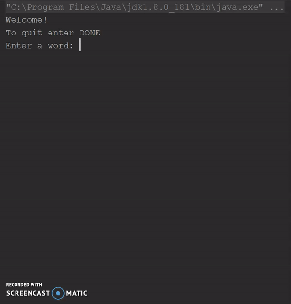

# AutoCorrect
Program takes in a text file with each line containing a dictionary word. Users are asked to type in a word and if it is
misspelled and in the dictionary then the program suggests the correct word.

## Demo

